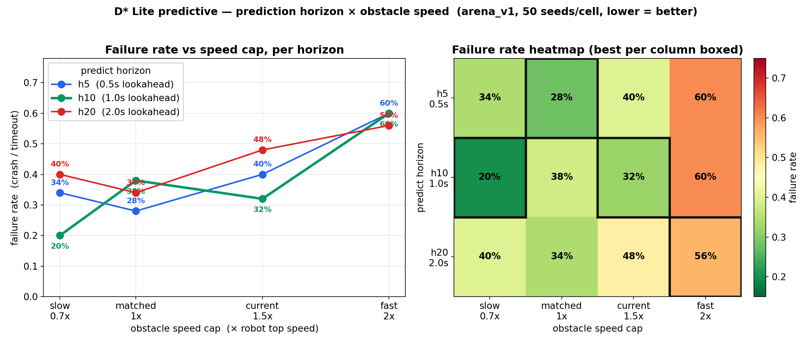

# Predictive D* Lite — horizon × speed grid findings

Does tuning the prediction horizon per obstacle-speed regime lower the failure
rate of `d_star_lite_predictive` (the lidar-only motion-aware planner)? This runs
the full grid of prediction horizons {5, 10, 20} against all four speed regimes
and reads off the best horizon per regime.

- **World:** `arena/arena_v1.yaml`, traffic on, 50 canonical seeds per cell (master
  seed 20260605).
- **Planner:** `d_star_lite_predictive` (`--predict-horizon` = 5/10/20 steps, T =
  0.5 / 1.0 / 2.0 s at the 0.1 s step time).
- **Regimes:** obstacle-speed cap as a factor of robot top speed — slow 0.7×,
  matched 1.0×, current 1.5×, fast 2.0×.
- **Metric:** failure rate = (crash + timeout + planner_error) / 50; median time
  over successful episodes. Zero planner errors and zero timeouts across the grid,
  so every failure here is a crash.



## Results

Failure rate (median time-to-goal in seconds), 50 seeds per cell. **Bold** = best
horizon for that regime.

| Regime | cap | h5 (0.5 s) | h10 (1.0 s) | h20 (2.0 s) |
|--------|----:|:----------:|:-----------:|:-----------:|
| slow | 0.7× | 0.34 (86) | **0.20 (87)** | 0.40 (95) |
| matched | 1.0× | **0.28 (81)** | 0.38 (88) | 0.34 (95) |
| current | 1.5× | 0.40 (84) | **0.32 (86)** | 0.48 (90) |
| fast | 2.0× | 0.60 (84) | 0.60 (84) | **0.56 (97)** |

The h10 column matches the earlier obstacle-speed sweep (`d_star_lite_predictive_h10`)
exactly, which cross-checks the two runs.

## Findings

1. **No universal best horizon.** h10 wins at slow and current, h5 wins at
   matched, and fast is a three-way wash (0.56–0.60, within seed noise). The
   optimum shifts with obstacle speed, so a single fixed horizon leaves failures
   on the table at some regimes.

2. **h10 is the right default.** It is best or tied-best at two of four regimes and
   is never the worst. Keeping the shipped `PREDICT_HORIZON = 10` is defensible.

3. **Per-regime tuning helps at exactly one regime.** Against fixed h10, picking the
   best horizon per regime only improves matched (0.38 → 0.28 at h5) and marginally
   fast (0.60 → 0.56 at h20, inside noise); slow and current are already optimal at
   h10. So "tune the horizon per speed and they all get better" is false — the win
   is concentrated at matched.

4. **h20 over-stamps at low/mid speed.** A 2.0 s lookahead stamps a larger predicted
   footprint, which seals corridors and forces conservative detours: it is the worst
   horizon at slow (0.40) and current (0.48) and is consistently slower (median
   90–97 s vs 84–88 s for h5/h10). Only at fast, where obstacles travel far per
   step, does the longer horizon stop hurting.

5. **Fast is not a horizon problem.** At the 2.0× cap every horizon lands at
   0.56–0.60. When obstacles can outrun the robot, no lookahead routes it clear;
   the speed cliff dominates, and the estimator (not the horizon) is the lever that
   would matter — the oracle variant was far better at comparable caps.

**Caveat:** 50-seed samples, so the standard error on a rate is ≈ 0.07 (about 3–4
episodes). The firm result is slow's h10 win (0.20 vs 0.34/0.40). The matched
h5-vs-h10 gap and the whole fast row are suggestive, not conclusive.

## Reproduce

```powershell
.venv\Scripts\Activate.ps1
foreach ($r in "slow","matched","current","fast") {
  foreach ($h in 5,10,20) {
    python -m runners.run_experiment --algorithm d_star_lite_predictive `
      --predict-horizon $h --world arena/arena_v1.yaml `
      --results-dir "results/speed_$r" --speed-regime $r --jobs 4 --traffic --resume
  }
}
```

Cells land in `results/speed_<regime>/arena_v1/d_star_lite_predictive_h<steps>/`.
The h10 cells come from the obstacle-speed sweep and are skipped by `--resume`.

The raw per-seed JSONs are gitignored; a snapshot is archived as a GitHub Release
asset (`results-snapshot-2026-07-05`).
