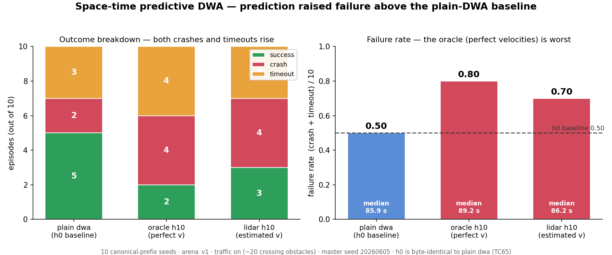

# Space-time predictive DWA — how it works and why it failed

A companion explainer to `2026-07-10-predictive-dwa.findings.md`. This walks
through what the space-time predictive DWA family actually *does*, how it is wired
into the existing DWA controller, and why — despite being a "more correct" planner
than the grid-stamping approach — it made the robot *worse*, even when handed
perfect obstacle velocities.



## The idea: reason in (x, y, t), not on a flat grid

The problem with a crossing obstacle is timing. A global grid planner like the
D\* Lite predictive family paints each obstacle's predicted future footprint onto
the occupancy grid — every cell it will pass through over the horizon is marked
blocked. That collapses the time axis: a cell the obstacle merely *passes through*
at t = 0.6 s is treated as permanently walled, so the planner refuses to use it
even at t = 0.1 s when it is still open.

Predictive DWA reasons in space *and* time. Inside DWA's forward-simulation
rollout it advances each tracked obstacle at constant velocity and checks the
robot against that obstacle **at the matched time step**:

- robot at rollout step `k` sits at `robot_positions[k-1]`,
- obstacle at step `k` sits at `(x + vx·k·dt, y + vy·k·dt)`,
- both at the *same* sim time.

A candidate that passes *behind* a crosser is fine — the crosser has moved on by
the time the robot arrives. A candidate that would *meet* it is rejected. This is
the mechanism of the two cited papers (Missura & Bennewitz, ICRA 2019; MDPI
*Actuators* 2025 14(5):207). It is the "right" way to do prediction, and it is why
this was worth building.

## How it's built

The whole family is a thin subclass. `PredictiveDWAController`
(`planners/dwa_predictive.py`) extends the plain `DWAController` and overrides
**only** `_evaluate_candidate` (plus `__init__` / `reset` / `observe_truth` and an
h0 shortcut). It does not reimplement the dynamic window, the sampling loop, the
rollout, or the fallback.

**1. The DWA base it rides on** (`planners/dwa.py`). Every tick, plain DWA builds
the acceleration-bounded window of feasible `(v, ω)`, samples a grid of candidates,
forward-simulates each over a 12-step rollout, and scores by heading + clearance +
speed, rejecting any rollout that grazes the live-lidar obstacle cloud. To make it
extensible, the per-candidate body was lifted into an overridable
`_evaluate_candidate(state, trajectory, v, obstacle_points)` seam. Plain `dwa` is
byte-identical to before (TC65).

**2. The two-layer collision model** (the override, `dwa_predictive.py:213`):

- **Present-position floor** — vanilla DWA's clearance check against the full live
  lidar cloud (walls *and* movers at their *current* positions). Hard-rejects any
  candidate whose rollout grazes a currently-visible body. This keeps the
  controller safe even when the tracker misses an obstacle.
- **Space-time layer** — the pure `planners._predict.trajectory_conflict`
  (`_predict.py:661`) over the horizon. Hard-rejects a matched-time collision with
  any track, and adds a capped predicted-clearance bonus
  (`PREDICTED_CLEARANCE_WEIGHT = 0.4`) so the robot eases away from a predicted
  conflict early rather than only at the last feasible instant.

**3. Velocity source behind a seam.** Both variants share the same `Tracker`
protocol and truth seam as the D\* Lite predictive family, so the *only* thing that
differs between them is where velocities come from:

- `dwa_predictive` (canonical) — `LidarTracker`, frame-differencing the live lidar
  to estimate each obstacle's velocity. The Mission-faithful variant.
- `dwa_predictive_oracle` (experimental) — `OracleTracker`, perfect live velocities
  fed through the runner's truth seam (`wants_truth = True`). A deliberate cheat
  that measures the *ceiling*: walls are checked identically, so any gap between the
  two is pure velocity-estimation error.

**4. Horizon and the h0 no-op.** `--predict-horizon H` sets the space-time depth
(H steps × 0.1 s). The rollout is lengthened to `max(ROLLOUT_STEPS, H)` so a long
horizon has robot poses to check against, but the base heading/clearance/speed
score still reads only the first 12 steps, so at h0 the space-time layer is empty
and the trace is byte-identical to plain `dwa` (TC65). h0 is therefore the exact
baseline in the chart above.

## The experiment

Quick read over the first 10 canonical seeds, arena_v1, traffic on
(~20 crossing obstacles), master seed 20260605, at h0 vs h10 (1.0 s of lookahead).

| Variant | Horizon | Failure rate | Median (s) | success / crash / timeout |
|--------|--------:|:------------:|:----------:|:-------------------------:|
| plain `dwa` (= h0)                  | 0  | **0.50** | 85.9 | 5 / 2 / 3 |
| `dwa_predictive_oracle` (perfect v) | 10 | **0.80** | 89.2 | 2 / 4 / 4 |
| `dwa_predictive` (lidar v)          | 10 | **0.70** | 86.2 | 3 / 4 / 3 |

Prediction made things worse at both velocity sources, and the *oracle* — with
perfect velocities — was the worst of the three.

## Why it doesn't work

**DWA already reasons about motion.** It is a velocity-space reactive planner:
every tick it forward-simulates each `(v, ω)` and rejects present-position
collisions. That is exactly why plain DWA already roughly halves hazard versus the
grid planners (see `project-replanning-no-safer-than-single-plan`). It was never
motion-blind, so there was little room for prediction to help.

**The space-time layer double-counts the movers.** With the layer bolted on, a
crossing obstacle is now avoided *twice*: once at its current position (the
present-position floor) and again at every predicted future position along the
horizon (the space-time layer). Under ~20 crossing obstacles, the union of those
predicted `(x, y, t)` reservations over a 1.0 s horizon rejects a large fraction of
the dynamic window every tick. The feasible set collapses, and the robot is forced
into its in-place-rotation fallback. This is the classic **freezing-robot
over-conservatism** (Trautman & Krause 2010).

The harm is graded, not a total freeze, and it shows up on **both** axes of the
left panel: more timeouts (the robot creeps or stalls) *and* more crashes (it gets
clipped while creeping), with median time edging up (85.9 → 89.2 s = more time
exposed to traffic).

**The oracle fails too, and that is the whole point.** With perfect velocities the
estimator is not the bottleneck. The space-time check is deterministic and correct
(TC65–TC68) — it is not a bug. So the failure is in the *policy* (a hard multi-step
reservation is far more conservative than DWA's one-step reactive check), not in
perception. The lidar variant is actually a touch *better* than the oracle here
(0.70 vs 0.80) only because its noisy velocities reserve a smaller, sloppier tube
than the oracle's tight, confident one — an accidental softening, not a fix.

## The lesson: prediction has to be matched to the planner

This is the exact opposite of the D\* Lite predictive result, where the oracle cut
failure 0.60 → 0.20 by stamping. The contrast is the takeaway:

- **Prediction helps a planner that ignores motion.** A global grid search plans
  straight into where movers are heading, so stamping their future footprints is
  pure gain.
- **Prediction hurts a planner that already reasons in velocity space.** DWA's
  one-step reactive check is already far less conservative than a hard multi-step
  space-time reservation, so bolting the reservation on top just freezes it.

"Real" `(x, y, t)` prediction is not automatically better than stamping or than
plain reactivity. It has to be matched to a planner that lacks motion reasoning, or
made much softer.

## What would be needed to make it help

None of these are tested by the quick read; they are the clear next levers:

- **Drop the present-position floor for *tracked* movers** so they are counted once
  (space-time) instead of twice. This is the most direct fix for the double-count.
- **Soft time-to-collision penalty instead of a hard rejection**, so a predicted
  conflict costs score rather than deleting the candidate — the window stays large.
- **Shorter horizon** (h5 reserves a smaller tube and over-rejects far less).
- **Smaller collision margin** or a **lower `PREDICTED_CLEARANCE_WEIGHT`**.

The full 50-seed × {0, 5, 10, 20} horizon sweep would locate the best non-zero
horizon, if any clears the plain-`dwa` baseline.

## Reproduce

```powershell
.venv\Scripts\Activate.ps1

# Horizon sweep (covers both D* Lite and DWA predictive families)
python -m runners.run_horizon_sweep  --world arena/arena_v1.yaml
python -m runners.plot_horizon_sweep --world arena/arena_v1.yaml

# Full 13-planner canonical comparison (dwa_predictive lands on the main scatter)
python -m runners.run_all --world arena/arena_v1.yaml
python -m runners.plot    --world arena/arena_v1.yaml
```

The figure above is regenerated by `docs/plans/`'s companion script; the raw
per-seed JSONs are gitignored.
